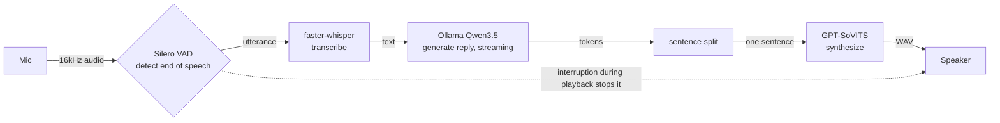
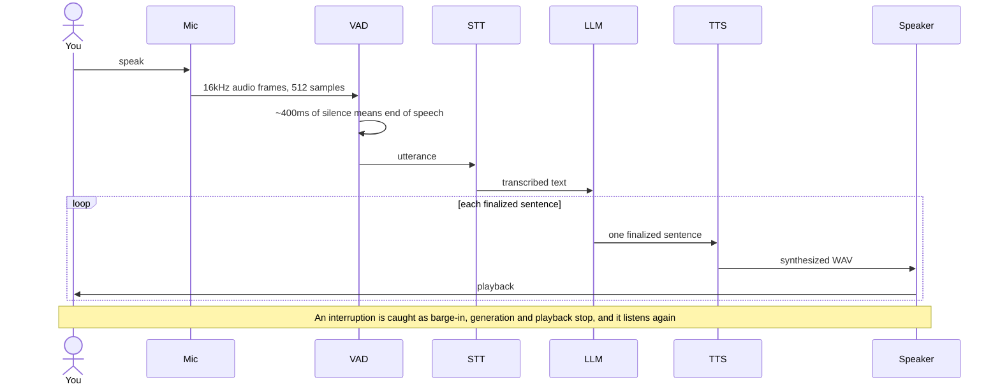
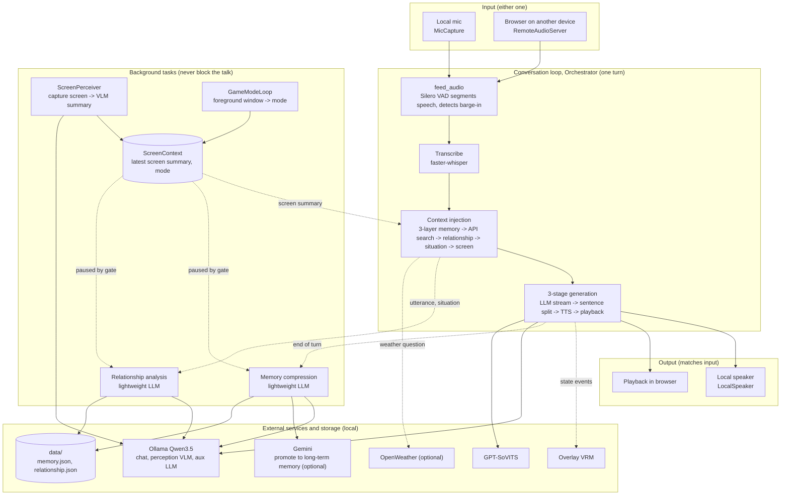

[日本語](README.md) | **English**


# Kotoha — 言葉

A local voice AI that replies in a clone of your own voice, without breaking the flow.
自分の声で、止まらずに喋れるローカル音声AI。

Talk into the mic and a local LLM thinks, then answers in a clone of your own voice. Everything runs on your own machine and nothing goes to the cloud (only the optional long-term-memory consolidation may reach out to Gemini). Cut in while it is talking and it stops to listen again. That last part is called barge-in.

The character that replies is "Tsukuyomi". She compresses and remembers past conversations, keeps a numeric relationship with the user, and weaves in the current time and the weather. A Japanese-specialized LLM is also selectable.

The longer-term plan is Discord voice support, with background work like research, coding, and app control running asynchronously and folding back into the conversation. A desktopmate-style overlay that puts a VRM character on the desktop is moving in parallel. The design is written up in the [design doc](docs/specs/2026-06-24-realtime-voice-bot-design.md).

## What it does

- Speech recognition, the LLM, and speech synthesis all run locally. They are meant to share a single RTX 4080, and no audio leaves the machine.
- Synthesis and playback overlap, sentence by sentence, so it starts speaking sooner.
- GPT-SoVITS reproduces a target voice from about a minute of fine-tuning.
- Speak up mid-playback and it stops at once to hear you out.
- Keeps a three-layer memory (immutable, long-term, short-term), compressing the gist to remember over time.
- Holds the relationship with the user as numbers such as affection and mood, adapting tone and closeness to the conversation.
- Pulls in outside facts like the weather through API search and folds them into the talk.
- Knows the current time and date, and gets puzzled by greetings that do not fit the hour.
- Captures the screen at intervals, summarizes it with a local VLM, and folds it into the talk. Off by default; switches to power-save or real-time when a game starts.

## How it works

Audio enters at the mic and moves through recognition, response generation, and synthesis on its way to the speaker. The path runs one way. The only thing that flows backward is an interruption during playback.



## One turn



## Overall architecture (current stage)

Around that simple one-way loop, the current stage adds swappable input and output, per-turn context injection, and background tasks that never make the reply wait. Input is either the local mic or a browser on another device, and output follows the same choice. In one turn, after transcription, the prompt is stacked in order with memory, API search, the relationship, the current situation, and the screen.

Screen perception, memory compression, relationship analysis, and game-mode watching run in the background. Heavy background inference is routed to auxiliary endpoints (`vlm_perception_url` / `aux_llm_url`), falling back to the local Ollama when unset. During a game's power-save mode, a pause gate stops the background LLMs.



## Algorithm

1. Read 16kHz mono audio from the mic in chunks of 512 samples. One frame is 32ms.
2. Silero VAD reads a speech probability per frame. After about 400ms of silence it calls the utterance done, and leftover frames carry to the next call.
3. Turn the segment into text with faster-whisper large-v3-turbo. An empty result counts as silence and is skipped.
4. Append the text to the history and ask Ollama Qwen3.5 to stream a reply. Thinking is always turned off, otherwise the think tag leaks into the voice.
5. Split the streamed tokens into sentences at periods, exclamation marks, and newlines.
6. Synthesize each finalized sentence with GPT-SoVITS. Synthesizing sentence N+1 while sentence N is still playing closes the gaps between sentences. It is a three-stage pipeline.
7. The VAD keeps running during playback. If you speak for about 250ms straight, generation stops, playback stops, and the synth and playback queues are dropped. The start of your interruption carries into the next round of recognition.

Silero VAD holds internal state. It is reset at every boundary: when an utterance finalizes, on barge-in, and when the speaker changes. The threading and queue design is in design doc §4.

## Memory, relationship, and API search

Before each reply, Tsukuyomi accounts for who she is and the situation. The prompt is built in priority order: the immutable memory first (name, tone, core character), then long-term memory (the user's profile and tastes), and finally short-term memory (the gist of this conversation).

- Memory. Recent turns stay in context as-is; older ones pushed out get compressed into bullet points by a lightweight LLM into short-term memory. Once short-term memory fills up, Gemini consolidates it into long-term memory. State persists in `data/memory.json`. Without a Gemini key, compression still works and only consolidation stops.
- Relationship. Affection, friendship, trust, and respect (0-100), plus the day's mood (-50 to 50). Each turn a lightweight LLM nudges them slightly from the utterance and the situation; higher values mean a closer tone. State persists in `data/relationship.json`.
- API search. If an utterance is a weather question, the current weather from OpenWeather is fetched and added to that turn's context only. More providers can be added.
- Time and date. She speaks with the current time in mind, and forms like `2026-06-28` are turned into conversational expressions such as today or tomorrow.

Memory and relationship persist under `data/` (git-ignored), and API keys are read from `.env`. The conversation still runs even when none of these are set.

## Usage

### Local services you need

| Service | Purpose | Default |
|---|---|---|
| [Ollama](https://ollama.com/) with `qwen3.5:4b` | Front LLM | `http://localhost:11434` |
| [GPT-SoVITS](https://github.com/RVC-Boss/GPT-SoVITS) server `api_v2.py` | Speech synthesis. Needs a fine-tuned model of the target voice and a reference clip | `http://localhost:9880` |
| faster-whisper | Speech recognition. Downloads the model on first run | `large-v3-turbo` |
| Gemini API (optional) | Consolidation into long-term memory. Only consolidation is disabled if unset | `GEMINI_API_KEY` |
| OpenWeather API (optional) | Weather API search. Only weather lookup is disabled if unset | `OPENWEATHER_API_KEY` |

An RTX 4080 16GB is the assumed GPU. STT and VAD also run on CPU. The default setup fits the reply model, the compression model, and recognition together within 16GB.

### Setup

```bash
# 1. Virtual environment
python -m venv .venv && source .venv/bin/activate

# 2. Install dependencies, including ML, local audio I/O, and dev tools
pip install -e ".[ml,local,dev]"

# 3. Pull models with Ollama. A lightweight model for memory compression and relationship analysis
ollama pull qwen3.5:4b
# Optional: a Japanese-specialized model for replies
ollama pull hf.co/mmnga-o/NVIDIA-Nemotron-Nano-9B-v2-Japanese-gguf:Q5_K_M

# 4. Start the GPT-SoVITS server separately, port 9880, with the fine-tuned voice

# 5. Optional: create .env to use API keys
cp .env.example .env   # fill in GEMINI_API_KEY and OPENWEATHER_API_KEY
```

### Run

```bash
# Diagnose the environment first if you want
python -m kotoha.diagnostics

# Start the conversation loop
python -m kotoha.local_app
```

On startup it checks that Ollama and GPT-SoVITS are reachable, then enters the mic-to-speaker loop. To actually produce sound, set the GPT-SoVITS reference clip at `Config.gptsovits_ref_audio_path` beforehand. Without it, nothing can be synthesized.

### Tests

```bash
# Unit tests. No audio hardware or external services; fakes are injected
pytest -m "not integration"

# Integration tests against real hardware and services. Needs GPU, Ollama, GPT-SoVITS, a mic, and so on
pytest -m integration
```

## Status

The local MVP pipeline has every module in place. To make sound, set a GPT-SoVITS reference clip, prepared separately, and start the local services.

| Area | Module | State |
|---|---|---|
| Config | `config.py` | done |
| Audio conversion | `voice/audio_utils.py` | done |
| VAD and barge-in | `voice/vad.py` | done |
| Speech recognition | `voice/stt.py` | done |
| LLM | `llm/persona.py`, `llm/front_client.py` | done |
| Sentence split | `llm/sentence_splitter.py` | done |
| Synthesis client | `voice/tts_gptsovits.py` | done |
| Local playback | `voice/speaker.py` | done |
| Local mic | `voice/mic.py` | done |
| Orchestrator | `orchestrator.py` | done, the core |
| Entry and health | `local_app.py`, `health.py` | done |
| Diagnostics | `diagnostics.py` | done |
| Overlay link, SP2 | `overlay_bridge.py`, `events.py` | done, Python side |
| Overlay rendering, SP1 | `overlay/`, Electron and three-vrm | done |
| Three-layer memory | `memory/` | done |
| Relationship parameters | `relationship/` | done |
| API search (weather) | `tools/` | done |
| Screen perception | `screen/`, `llm/vlm_client.py` | done, opt-in (off by default) |

Python unit tests pass 210 cases. Screen perception defaults to reusing the same `qwen3.5:4b` (vision-capable) as the chat model on a single GPU (RTX 4080), and this is verified on real hardware. To route it to a separate backend such as a Radeon VII, override `vlm_perception_url` / `aux_llm_url`. The overlay is implemented through rendering (SP1) and desktop interaction (SP3). Discord support remains a later plan.

## Layout

```
kotoha/   the implementation: voice, llm, and screen, plus orchestrator, local_app, health, diagnostics, overlay_bridge, events, config
overlay/  desktop overlay: Electron and three-vrm
tests/    unit and integration tests
docs/
  specs/  design docs
  plans/  implementation plans, with task breakdown and TDD steps
```

## Tech stack

Built on Python 3.11+ and asyncio, with sounddevice, Silero VAD, faster-whisper, Ollama Qwen3.5, GPT-SoVITS, aiohttp, numpy, and pytest. See the [design doc](docs/specs/2026-06-24-realtime-voice-bot-design.md) for details.

## Credits

The voice is referenced and trained from the [Tsukuyomi-chan Corpus](https://tyc.rei-yumesaki.net/about/introduction/). The character "Tsukuyomi-chan" is the work of Rei Yumesaki, and the **default character** "Tsukuyomi" in this project derives from it (the character is changeable; Tsukuyomi is the default). Follow the distributor's terms when using it.

## License

[Apache License 2.0](LICENSE) © 2026 4ltena

This covers the code in this repository. The Tsukuyomi-chan voice and character are governed by the terms noted in Credits above.
