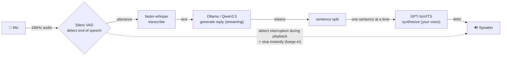
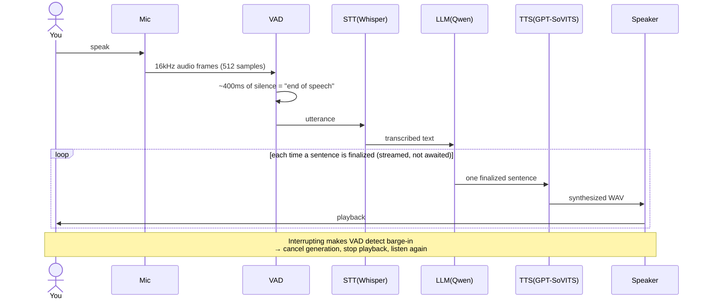

[日本語](README.md) | **English**


# Kotoha 🎙️ — 言葉 (Kotoha = "spoken words")

**A local voice AI that talks back in a clone of your own voice — without breaking the flow.**
*自分の声で、止まらずに喋れるローカル音声AI。*

(version 0.1.0)

Talk into the mic and a local LLM thinks, then replies **in a clone of your own voice**.
Everything runs on your PC (nothing is sent to the cloud). If you cut in while it is still talking, it stops and listens again (**barge-in**).

> Future plans: Discord VC support, running background tasks (research / coding / app control) asynchronously, and overlaying a VRM character on the desktop (a desktopmate-style overlay). For now the focus is a **local-only conversation MVP**. See the design doc: [`docs/specs/2026-06-24-realtime-voice-bot-design.md`](docs/specs/2026-06-24-realtime-voice-bot-design.md).

---

## ✨ Features

- 🏠 **Fully local**: speech recognition, LLM, and speech synthesis all run locally (co-located on a single RTX 4080)
- ⚡ **Low latency**: synthesis and playback are pipelined per sentence, so it starts speaking quickly
- 🎭 **Voice cloning**: GPT-SoVITS reproduces a target voice from about a minute of fine-tuning
- ✋ **Barge-in**: speak up while the bot is talking and it stops immediately to listen

---

## 🏗️ How it works (overview)

Audio flows one way — "mic → recognize → respond → synthesize → speaker" — and only an interruption during playback flows backward.



---

## 🔄 One turn



---

## 🧠 Algorithm (simple version)

1. **Capture** — read 16kHz mono audio from the mic in 512-sample (=32ms) frames
2. **Segment** — Silero VAD looks at each frame's speech probability and decides **end of speech after ~400ms of silence** (leftover frames carry to the next call)
3. **Transcribe** — turn the segment into text with faster-whisper (`large-v3-turbo`) (empty = treated as silence, skipped)
4. **Think** — append the text to the conversation history and ask Ollama's Qwen3.5 to stream a reply (**thinking is OFF** so `<think>` never leaks into the voice)
5. **Split into sentences** — split the streamed tokens at `。．！？!?` and newlines
6. **Speak** — synthesize each finalized sentence with GPT-SoVITS. **While sentence N plays, sentence N+1 is synthesized**, closing the gaps (a 3-stage pipeline)
7. **Barge-in** — keep running the user's VAD during playback; if they speak **continuously for ~250ms**: cancel generation, stop playback, and discard the synth/playback queues. The start of the interruption (pre-roll) is carried into the next recognition

> Note: Silero VAD is stateful, so it is **reset at every boundary — utterance finalization, barge-in, and speaker switch**. See design doc §4 for the threading and queue design.

---

## 🚀 Usage

### Requirements (local services)

| Service | Purpose | Default |
|---|---|---|
| [Ollama](https://ollama.com/) + `qwen3.5:4b` | Front LLM | `http://localhost:11434` |
| [GPT-SoVITS](https://github.com/RVC-Boss/GPT-SoVITS) server (`api_v2.py`) | TTS (needs a fine-tuned model of the target voice + a reference clip) | `http://localhost:9880` |
| faster-whisper | STT (model auto-downloads on first run) | `large-v3-turbo` |

Assumes an RTX 4080 (16GB) GPU. STT/VAD can fall back to CPU.

### Setup

```bash
# 1. Virtual environment
python -m venv .venv && source .venv/bin/activate

# 2. Install dependencies (ML + local audio I/O + dev tools)
pip install -e ".[ml,local,dev]"

# 3. Pull the model with Ollama
ollama pull qwen3.5:4b

# 4. Start the GPT-SoVITS server separately (port 9880, with the fine-tuned voice)
```

### Run

```bash
# (optional) Diagnose the environment first (Ollama up / model present / GPT-SoVITS reachable / audio devices)
python -m kotoha.diagnostics

# Start the conversation loop
python -m kotoha.local_app
```

> On startup it health-checks Ollama / GPT-SoVITS, then enters the mic↔speaker conversation loop.
> Note: real TTS output requires setting the GPT-SoVITS reference clip (your voice data) at `Config.gptsovits_ref_audio_path` (without it, nothing can be synthesized).

### Tests

```bash
# Unit tests (no audio hardware or external services; fakes are injected)
pytest -m "not integration"

# Integration tests using real hardware/services (needs GPU/Ollama/GPT-SoVITS/mic, etc.)
pytest -m integration
```

---

## ✅ Status

The local MVP pipeline is **fully implemented**. To actually produce sound you still need to set a **GPT-SoVITS reference clip (voice data)**, prepared separately, and start the local services.

| Area | Module | Status |
|---|---|---|
| Config | `config.py` | ✅ done |
| Audio conversion | `voice/audio_utils.py` | ✅ done |
| VAD / barge-in | `voice/vad.py` | ✅ done |
| STT | `voice/stt.py` | ✅ done |
| LLM | `llm/persona.py` / `llm/front_client.py` | ✅ done |
| Sentence split | `llm/sentence_splitter.py` | ✅ done |
| TTS client | `voice/tts_gptsovits.py` | ✅ done |
| Local playback | `voice/speaker.py` | ✅ done |
| Local mic | `voice/mic.py` | ✅ done |
| **Orchestrator** | `orchestrator.py` | ✅ done (core) |
| Entrypoint / health | `local_app.py` / `health.py` | ✅ done |
| Diagnostics | `diagnostics.py` | ✅ done |
| Overlay integration (SP2) | `overlay_bridge.py` / `events.py` | ✅ done (Python side) |

Unit tests currently: **84 passed** (`-m "not integration"`). The desktop overlay's rendering side **SP1 (Electron + three-vrm)** is next. Discord support (receive/playback/bot wiring) is planned after the MVP is fully working.

---

## 📁 Layout

```
kotoha/        implementation (voice/ llm/ + orchestrator/local_app/health/diagnostics/overlay_bridge/events/config)
tests/         unit + integration tests
docs/
  specs/       design docs
  plans/       implementation plans (task breakdown / TDD steps)
```

---

## 🛠️ Tech stack

Python 3.11+ / asyncio · sounddevice · Silero VAD · faster-whisper · Ollama (Qwen3.5) · GPT-SoVITS · aiohttp · numpy · pytest

See the **[design doc](docs/specs/2026-06-24-realtime-voice-bot-design.md)** for details.

---

## 📄 License

[Apache License 2.0](LICENSE) © 2026 4ltena
