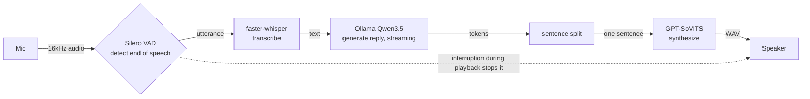
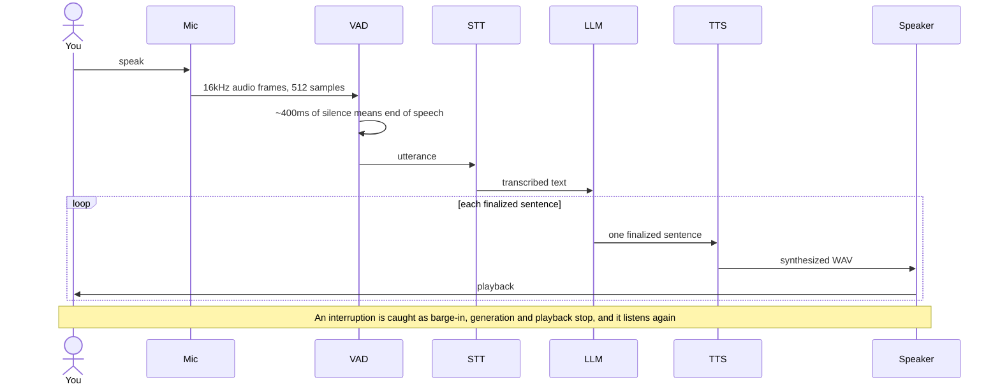

[日本語](README.md) | **English**


# Kotoha — 言葉

A local voice AI that replies in a clone of your own voice, without breaking the flow.
自分の声で、止まらずに喋れるローカル音声AI。

version 0.1.0

Talk into the mic and a local LLM thinks, then answers in a clone of your own voice. Everything runs on your own machine and nothing goes to the cloud. Cut in while it is talking and it stops to listen again. That last part is called barge-in.

The longer-term plan is Discord voice support, with background work like research, coding, and app control running asynchronously and folding back into the conversation. A desktopmate-style overlay that puts a VRM character on the desktop is moving in parallel. For now the work is a local-only conversation MVP. The design is written up in the [design doc](docs/specs/2026-06-24-realtime-voice-bot-design.md).

## What it does

- Speech recognition, the LLM, and speech synthesis all run locally. They are meant to share a single RTX 4080, and no audio leaves the machine.
- Synthesis and playback overlap, sentence by sentence, so it starts speaking sooner.
- GPT-SoVITS reproduces a target voice from about a minute of fine-tuning.
- Speak up mid-playback and it stops at once to hear you out.

## How it works

Audio enters at the mic and moves through recognition, response generation, and synthesis on its way to the speaker. The path runs one way. The only thing that flows backward is an interruption during playback.



## One turn



## Algorithm

1. Read 16kHz mono audio from the mic in chunks of 512 samples. One frame is 32ms.
2. Silero VAD reads a speech probability per frame. After about 400ms of silence it calls the utterance done, and leftover frames carry to the next call.
3. Turn the segment into text with faster-whisper large-v3-turbo. An empty result counts as silence and is skipped.
4. Append the text to the history and ask Ollama Qwen3.5 to stream a reply. Thinking is always turned off, otherwise the think tag leaks into the voice.
5. Split the streamed tokens into sentences at periods, exclamation marks, and newlines.
6. Synthesize each finalized sentence with GPT-SoVITS. Synthesizing sentence N+1 while sentence N is still playing closes the gaps between sentences. It is a three-stage pipeline.
7. The VAD keeps running during playback. If you speak for about 250ms straight, generation stops, playback stops, and the synth and playback queues are dropped. The start of your interruption carries into the next round of recognition.

Silero VAD holds internal state. It is reset at every boundary: when an utterance finalizes, on barge-in, and when the speaker changes. The threading and queue design is in design doc §4.

## Usage

### Local services you need

| Service | Purpose | Default |
|---|---|---|
| [Ollama](https://ollama.com/) with `qwen3.5:4b` | Front LLM | `http://localhost:11434` |
| [GPT-SoVITS](https://github.com/RVC-Boss/GPT-SoVITS) server `api_v2.py` | Speech synthesis. Needs a fine-tuned model of the target voice and a reference clip | `http://localhost:9880` |
| faster-whisper | Speech recognition. Downloads the model on first run | `large-v3-turbo` |

An RTX 4080 16GB is the assumed GPU. STT and VAD also run on CPU.

### Setup

```bash
# 1. Virtual environment
python -m venv .venv && source .venv/bin/activate

# 2. Install dependencies, including ML, local audio I/O, and dev tools
pip install -e ".[ml,local,dev]"

# 3. Pull the model with Ollama
ollama pull qwen3.5:4b

# 4. Start the GPT-SoVITS server separately, port 9880, with the fine-tuned voice
```

### Run

```bash
# Diagnose the environment first if you want
python -m kotoha.diagnostics

# Start the conversation loop
python -m kotoha.local_app
```

On startup it checks that Ollama and GPT-SoVITS are reachable, then enters the mic-to-speaker loop. To actually produce sound, set the GPT-SoVITS reference clip at `Config.gptsovits_ref_audio_path` beforehand. Without it, nothing can be synthesized.

### Tests

```bash
# Unit tests. No audio hardware or external services; fakes are injected
pytest -m "not integration"

# Integration tests against real hardware and services. Needs GPU, Ollama, GPT-SoVITS, a mic, and so on
pytest -m integration
```

## Status

The local MVP pipeline has every module in place. To make sound, set a GPT-SoVITS reference clip, prepared separately, and start the local services.

| Area | Module | State |
|---|---|---|
| Config | `config.py` | done |
| Audio conversion | `voice/audio_utils.py` | done |
| VAD and barge-in | `voice/vad.py` | done |
| Speech recognition | `voice/stt.py` | done |
| LLM | `llm/persona.py`, `llm/front_client.py` | done |
| Sentence split | `llm/sentence_splitter.py` | done |
| Synthesis client | `voice/tts_gptsovits.py` | done |
| Local playback | `voice/speaker.py` | done |
| Local mic | `voice/mic.py` | done |
| Orchestrator | `orchestrator.py` | done, the core |
| Entry and health | `local_app.py`, `health.py` | done |
| Diagnostics | `diagnostics.py` | done |
| Overlay link, SP2 | `overlay_bridge.py`, `events.py` | done, Python side |

Unit tests pass 84 cases right now. The overlay's rendering side, SP1 with Electron and three-vrm, is next. Discord support comes after the MVP runs end to end.

## Layout

```
kotoha/   the implementation: voice and llm, plus orchestrator, local_app, health, diagnostics, overlay_bridge, events, config
tests/    unit and integration tests
docs/
  specs/  design docs
  plans/  implementation plans, with task breakdown and TDD steps
```

## Tech stack

Built on Python 3.11+ and asyncio, with sounddevice, Silero VAD, faster-whisper, Ollama Qwen3.5, GPT-SoVITS, aiohttp, numpy, and pytest. See the [design doc](docs/specs/2026-06-24-realtime-voice-bot-design.md) for details.

## License

[Apache License 2.0](LICENSE) © 2026 4ltena
