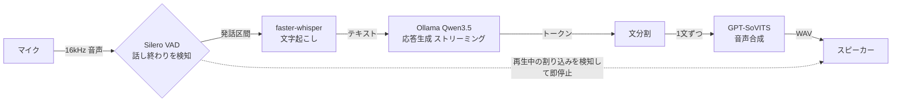
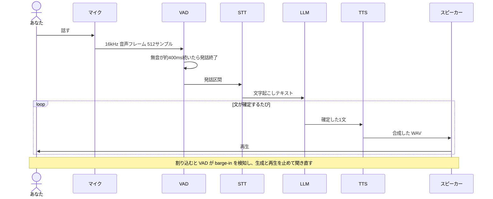

**日本語** | [English](README.en.md)


# Kotoha

自分の声で、途切れずに会話できるローカル音声AI。
A local voice AI that replies in a clone of your own voice, without breaking the flow.

version 0.1.0

マイクに話しかけると、ローカルの LLM が応答を考え、利用者の声をクローンした音声で返答する。処理は手元の PC で完結し、クラウドへは何も送信しない。応答の再生中に割り込むと、再生を停止して聞き直す。この動作を barge-in と呼ぶ。

将来は Discord のボイスチャットに対応し、調べ物やコーディング、アプリ操作を背後で非同期に実行して会話へ合流させる構想がある。デスクトップに VRM キャラクターを重ねる desktopmate 風のオーバーレイも並行して進めている。現時点ではローカルのみで対話する MVP を実装している段階である。設計の詳細は[設計書](docs/specs/2026-06-24-realtime-voice-bot-design.md)に記載した。

## 特徴

- 音声認識、LLM、音声合成のすべてをローカルで動作させる。RTX 4080 一枚に同居させる前提で、音声を外部へ送信しない。
- 文ごとに区切って合成と再生を重ねる。そのため発話を開始するまでの遅延が小さい。
- GPT-SoVITS が約1分のファインチューンから目標の声を再現する。
- 再生中に話しかけると即座に停止し、利用者の発話を聞き直す。

## 仕組み

音声はマイクから入り、認識、応答生成、合成の順に処理されてスピーカーへ出力される。流れは一方向で、逆向きに作用するのは再生中の割り込みのみである。



## 1ターンの流れ



## アルゴリズム

1. マイクから 16kHz モノラルの音声を 512 サンプルずつ取り込む。1 フレームは 32ms に相当する。
2. Silero VAD が各フレームの発話確率を評価する。無音が約 400ms 続いた時点で発話終了と判断し、端数のフレームは次回へ繰り越す。
3. 発話区間を faster-whisper の large-v3-turbo でテキスト化する。空の場合は沈黙とみなして処理を省く。
4. テキストを会話履歴に追加し、Ollama の Qwen3.5 へストリーミング生成を要求する。思考は必ず無効化する。無効化しないと think タグが音声へ漏れる。
5. 受信したトークンを句点や感嘆符、改行で文へ分割する。
6. 確定した文ごとに GPT-SoVITS で合成する。文 N の再生中に文 N+1 を合成しておくことで、文間の間隔を短縮する。三段のパイプラインである。
7. 再生中も VAD は動作を続ける。約 250ms 継続して発話が検出された場合、生成と再生を停止し、合成と再生のキューを破棄する。割り込みの冒頭は次回の認識へ引き継ぐ。

Silero VAD は内部状態を持つため、発話確定、barge-in、話者の切り替えの各境界で必ずリセットする。スレッド構成とキュー設計は設計書 §4 に記載した。

## 使い方

### 必要なローカルサービス

| サービス | 用途 | 既定 |
|---|---|---|
| [Ollama](https://ollama.com/) と `qwen3.5:4b` | フロント LLM | `http://localhost:11434` |
| [GPT-SoVITS](https://github.com/RVC-Boss/GPT-SoVITS) サーバ `api_v2.py` | 音声合成。目標声のファインチューン済みモデルと参照音声が必要 | `http://localhost:9880` |
| faster-whisper | 音声認識。初回にモデルを自動ダウンロードする | `large-v3-turbo` |

GPU は RTX 4080 16GB を想定している。STT と VAD は CPU でも動作する。

### セットアップ

```bash
# 1. 仮想環境
python -m venv .venv && source .venv/bin/activate

# 2. 依存をインストールする。ML、ローカル音声 I/O、開発ツールを含む
pip install -e ".[ml,local,dev]"

# 3. Ollama でモデルを用意する
ollama pull qwen3.5:4b

# 4. GPT-SoVITS サーバを別途起動する。ポート 9880、ファインチューン済みの声
```

### 起動

```bash
# 起動前に環境を診断する場合
python -m kotoha.diagnostics

# 対話ループを起動する
python -m kotoha.local_app
```

起動すると Ollama と GPT-SoVITS の疎通を確認し、マイクとスピーカーの対話ループに入る。実際に音声を出力するには、GPT-SoVITS の参照音声を `Config.gptsovits_ref_audio_path` に設定する。未設定の場合は合成できない。

### テスト

```bash
# ユニットテスト。音声ハードや外部サービスは不要で、fake を注入する
pytest -m "not integration"

# 実機と実サービスを使う統合テスト。GPU、Ollama、GPT-SoVITS、マイクなどが必要
pytest -m integration
```

## 実装状況

ローカル MVP のパイプラインは全モジュールが揃っている。実際に音声を出力するには、別途用意する GPT-SoVITS の参照音声を設定し、各ローカルサービスを起動する。

| 区分 | モジュール | 状態 |
|---|---|---|
| 設定 | `config.py` | 完成 |
| 音声変換 | `voice/audio_utils.py` | 完成 |
| VAD と barge-in | `voice/vad.py` | 完成 |
| 音声認識 | `voice/stt.py` | 完成 |
| LLM | `llm/persona.py`, `llm/front_client.py` | 完成 |
| 文分割 | `llm/sentence_splitter.py` | 完成 |
| 音声合成クライアント | `voice/tts_gptsovits.py` | 完成 |
| ローカル再生 | `voice/speaker.py` | 完成 |
| ローカルマイク | `voice/mic.py` | 完成 |
| オーケストレータ | `orchestrator.py` | 完成。中核 |
| 起動口と疎通 | `local_app.py`, `health.py` | 完成 |
| 環境診断 | `diagnostics.py` | 完成 |
| オーバーレイ連携 SP2 | `overlay_bridge.py`, `events.py` | 完成。Python 側 |
| オーバーレイ描画 SP1 | `overlay/`, Electron と three-vrm | 完成 |

Python のユニットテストは現時点で 84 件成功する。オーバーレイの描画基盤 SP1 は実装済みで、デスクトップ干渉 SP3 を現在進めている。Discord 対応は MVP が一通り動作してから着手する。

## ディレクトリ

```
kotoha/   実装本体。voice と llm のほか orchestrator, local_app, health, diagnostics, overlay_bridge, events, config
overlay/  デスクトップ・オーバーレイ。Electron と three-vrm
tests/    ユニットと統合テスト
docs/
  specs/  設計書
  plans/  実装計画。タスク分解と TDD 手順
```

## 技術スタック

Python 3.11+ と asyncio を基盤とし、sounddevice、Silero VAD、faster-whisper、Ollama の Qwen3.5、GPT-SoVITS、aiohttp、numpy、pytest を使用する。オーバーレイは Electron、three.js、@pixiv/three-vrm で実装している。設計の詳細は[設計書](docs/specs/2026-06-24-realtime-voice-bot-design.md)を参照。

## ライセンス

[Apache License 2.0](LICENSE) © 2026 4ltena
