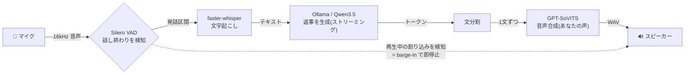
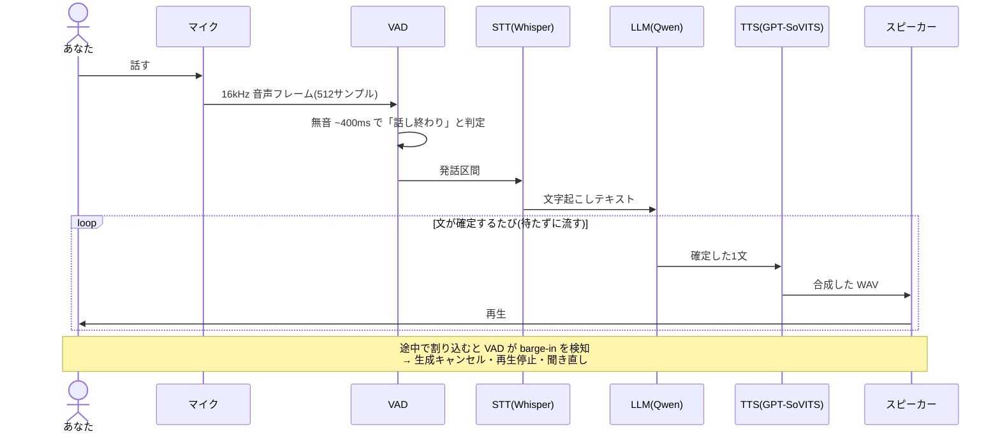

# Kotoha 🎙️ — 言葉

**自分の声で、止まらずに喋れるローカル音声AI。**

マイクに話しかけると、ローカルの LLM が考えて、**あなたの声をクローンした声**で返事をします。
すべてローカル PC で完結（クラウド送信なし）。相手が喋っている途中で割り込んでも、ちゃんと止まって聞き直します（**barge-in**）。

> 将来的には Discord VC 対応＋裏で「調べ物・コーディング・アプリ操作」を非同期実行する構想。まずは**ローカルだけで対話できる MVP** を作っています。詳細設計は [`docs/specs/2026-06-24-realtime-voice-bot-design.md`](docs/specs/2026-06-24-realtime-voice-bot-design.md) を参照。

---

## ✨ 特徴

- 🏠 **完全ローカル**: 音声認識・LLM・音声合成すべてローカル（RTX 4080 1枚に同居）
- ⚡ **低遅延**: 文ごとに区切って合成・再生をパイプライン化。喋り始めるまでが速い
- 🎭 **ボイスクローン**: GPT-SoVITS で目標の声を約1分のファインチューンから再現
- ✋ **割り込み対応(barge-in)**: bot が喋っている最中でも、話しかければ即停止して聞き直す

---

## 🏗️ しくみ（全体像）

声が「マイク → 認識 → 応答 → 合成 → スピーカー」と一方向に流れ、再生中の割り込みだけが逆向きに効きます。



---

## 🔄 1ターンの流れ



---

## 🧠 アルゴリズム（簡単版）

1. **拾う** — マイクから 16kHz mono の音声を 512 サンプル(=32ms)ずつ取り込む
2. **区切る** — Silero VAD が各フレームの「発話確率」を見て、**無音が ~400ms 続いたら発話終了**と判断（端数フレームは次回へ繰り越し）
3. **書き起こす** — 区間を faster-whisper(`large-v3-turbo`)でテキスト化（空なら沈黙扱いでスキップ）
4. **考える** — テキストを会話履歴に足し、Ollama の Qwen3.5 へストリーミング生成を依頼（**思考(thinking)は OFF** = `<think>` が声に漏れないように）
5. **文に割る** — 流れてくるトークンを `。．！？!?改行` で文に区切る
6. **声にする** — 確定した文ごとに GPT-SoVITS で合成。**文 N を再生しながら文 N+1 を合成**しておくことで間を詰める（3段パイプライン）
7. **割り込み(barge-in)** — 再生中もユーザーの VAD を回し続け、**~250ms 連続で喋り出したら**：生成キャンセル＋再生停止＋合成/再生キュー破棄。割り込み冒頭(pre-roll)は次の認識へ引き継ぐ

> 補足: Silero VAD は内部状態を持つ（ステートフル）ため、**発話確定・barge-in・話者切替の各境界で必ずリセット**します。詳しいスレッド構成やキュー設計は設計書 §4 を参照。

---

## 🚀 使い方

### 必要なもの（ローカルサービス）

| サービス | 用途 | 既定 |
|---|---|---|
| [Ollama](https://ollama.com/) + `qwen3.5:4b` | フロント LLM | `http://localhost:11434` |
| [GPT-SoVITS](https://github.com/RVC-Boss/GPT-SoVITS) サーバ(`api_v2.py`) | TTS（要：目標声のファインチューン済みモデル＋参照音声） | `http://localhost:9880` |
| faster-whisper | STT（初回にモデル自動DL） | `large-v3-turbo` |

GPU は RTX 4080 (16GB) 想定。STT/VAD は CPU フォールバックも可。

### セットアップ

```bash
# 1. 仮想環境
python -m venv .venv && source .venv/bin/activate

# 2. 依存インストール（ML + 開発ツール）
pip install -e ".[ml,dev]"
#   ※ ローカル音声 I/O 用の [local] extra（sounddevice）は mic/speaker 実装と
#      同時に追加予定。完成後は ".[ml,local,dev]" を使う。

# 3. Ollama でモデルを用意
ollama pull qwen3.5:4b

# 4. GPT-SoVITS サーバを別途起動（ポート 9880、ファインチューン済みの声）
```

### 起動（実装完了後）

```bash
python -m kotoha.local_app
```

> 起動口 `kotoha/local_app.py` は現在実装中（下表参照）。完成すると、起動時に Ollama / GPT-SoVITS の疎通チェックを行い、マイク↔スピーカーの対話ループに入ります。

### テスト

```bash
# ユニットテスト（音声ハード・外部サービス不要、fake注入）
pytest -m "not integration"

# 実機・実サービスを使う統合テスト（要：GPU/Ollama/GPT-SoVITS/マイク等）
pytest -m integration
```

---

## ✅ 実装状況

中核となる「部品」は完成済み。残りは**全部品をつなぐ Orchestrator** と**ローカル入出力・起動口**です。

| 区分 | モジュール | 状態 |
|---|---|---|
| 設定 | `config.py` | ✅ 完成 |
| 音声変換 | `voice/audio_utils.py` | ✅ 完成 |
| VAD / barge-in | `voice/vad.py` | ✅ 完成 |
| STT | `voice/stt.py` | ✅ 完成 |
| LLM | `llm/persona.py` / `llm/front_client.py` | ✅ 完成 |
| 文分割 | `llm/sentence_splitter.py` | ✅ 完成 |
| TTS クライアント | `voice/tts_gptsovits.py` | ⏳ 未実装 |
| ローカル再生 | `voice/speaker.py` | ⏳ 未実装 |
| ローカルマイク | `voice/mic.py` | ⏳ 未実装 |
| **Orchestrator** | `orchestrator.py` | ⏳ 未実装（中核） |
| 起動口 / 疎通 | `local_app.py` / `health.py` | ⏳ 未実装 |

ユニットテストは現在 **28 passed**（`-m "not integration"`）。Discord 対応（受信/再生/bot 配線）は MVP 完動後に着手予定。

---

## 📁 ディレクトリ

```
kotoha/        実装本体（voice/ llm/ + orchestrator/local_app/health/config）
tests/          ユニット + integration テスト
docs/
  specs/        設計書（詳細設計）
  plans/        実装計画（タスク分解 / TDD 手順）
  HANDOFF.md    引き継ぎメモ（ローカル専用 / git管理外）
```

---

## 🛠️ 技術スタック

Python 3.11+ / asyncio · sounddevice · Silero VAD · faster-whisper · Ollama(Qwen3.5) · GPT-SoVITS · aiohttp · numpy · pytest

詳しい設計は **[設計書](docs/specs/2026-06-24-realtime-voice-bot-design.md)** を参照してください。

---

## 📄 ライセンス

[MIT License](LICENSE) © 2026 4ltena
