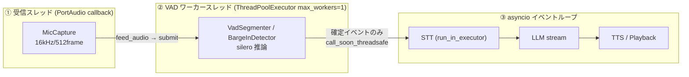
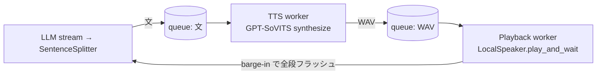

# リアルタイム音声会話bot 設計書

- 日付: 2026-06-24（改訂: 2026-06-25）
- ステータス: ドラフト / フェーズ1（ローカルMVP）実装中
- 改訂サマリ:
  - **TTS をボイスクローン対応の GPT-SoVITS（ファインチューン版）に決定**
  - **まず Discord 非依存の「ローカルonly 対話 MVP」を先に作る**方針へ転換（I/O 端のみローカルへ差し替え、対話コアは流用）
  - **フロント LLM を Qwen3.5 系へ**（既定 `qwen3.5:4b` / 品質重視は `qwen3.5:9b`、リアルタイムでは思考(thinking)を必ず OFF）
  - フェーズ1の**詳細設計**（スレッドモデル / VAD アルゴリズム / barge-in / パイプライン / 各モジュール契約）を §4 に追記

> 高レベルな「使い方・しくみ」は README（リポジトリ直下 `README.md`）を参照。本書は**詳細設計**を扱う。

## 1. 目的

最終的には Discord のボイスチャンネル(VC)内で直接動作し、**遅延なくリアルタイムに音声会話**できる bot を作る。
さらに、会話を止めずに裏で「調べ物 / コーディング / アプリ操作」を非同期に実行し、結果を自然に会話へ合流させる。

### ゴール
- 音声入力 → 応答生成 → 音声合成を低遅延でループさせる
- 自然な会話のための **割り込み(barge-in)** と **相槌(バックチャネル)** に対応
- リアルタイム会話を一切止めずに裏エージェントを起動し、結果を自然に差し込む

### スコープ方針（重要）
- **MVP はローカルonly**: マイク/スピーカーをローカル(`sounddevice`)で直結し、Discord 非依存で対話ループを先に完成させる。設計が I/O を端に分離しているため、コア（VAD/STT/LLM/文分割/TTS/barge-in/Orchestrator）はそのまま流用し、**入出力端だけをローカルへ差し替える**。
- Discord 対応（受信シンク・再生・bot 配線）は MVP 完動後に着手（延期: DEFER）。

### 非ゴール(YAGNI)
- 完全ローカル縛りにはしない(速さ優先。裏の重い処理はクラウド公開モデル API も使う)
- フルの多段ディープリサーチ(遅延的に会話相棒には不向き)
- 複雑・オープンエンドなアプリ自動化(ホワイトリスト範囲に限定)

## 2. 前提・制約

| 項目 | 内容 |
|---|---|
| ハードウェア | RTX 4080 (VRAM 16GB) |
| 主言語 | 日本語 |
| モデル方針 | 速さ優先。ローカル/公開モデルを基本にしつつ、低遅延・高品質ならクラウド API も可 |
| 割り込み | 必要(自然な会話に必須) |
| 話者 | （Discord 版で）複数人 VC でも動作。受信はユーザー別。MVP は単一ローカルユーザー(`local_user_id`) |
| キャラ/用途 | 自分の声をクローンした、調べ物もできる雑談相手 |

### VRAM 配分(概算 / LLM+STT+TTS を 4080 一枚に同居)
- フロント LLM `qwen3.5:9b` (Q4_K_M) ~6.6GB + KV(8k) ~1GB ≒ **7.6GB**
- faster-whisper large-v3 (int8) ~**2–2.5GB**
- GPT-SoVITS（GPT/SoVITS 重み）残りに収まる
- → 合計 16GB に収まる見積り（速度重視で LLM を `qwen3.5:4b` Q4 ~3.4GB にすればさらに余裕）

## 3. 全体アーキテクチャ

中央に**非同期オーケストレータ**(asyncio)を置き、3レーンが並行動作する。

```
┌─────────────────────────────────────────────────────────┐
│  Orchestrator (asyncio event loop, 中央状態管理)          │
├──────────────┬───────────────────┬──────────────────────┤
│ 音声入力レーン │   会話レーン        │  裏エージェントレーン   │
│ Mic/Receiver  │  FrontLLM(stream)  │  Dispatcher          │
│  → VAD       │   → SentenceSplit  │   ├ ResearchHandler  │
│  → STT       │   → TTS → Playback │   ├ CodingHandler    │
│  (per-user)  │   ← barge-in中断    │   └ AppOpHandler     │
└──────────────┴───────────────────┴──────────────────────┘
```

**入出力端は差し替え可能**:
- ローカル MVP: `MicCapture`(入力) / `LocalSpeaker`(再生)
- Discord 版（後）: `PerUserSink`(受信) / Discord 再生

**中央状態**: 会話履歴(ローリングバッファ)、再生中フラグ、（フェーズ1.5以降）ターンテイキング状態機械、保留中ジョブ登録表、各処理のキャンセルトークン。

### 技術スタック

| 役割 | 採用 | 理由 / 代替 |
|---|---|---|
| 言語/基盤 | Python 3.11+ / asyncio | I/F 分離した小モジュールを中央 Orchestrator が配線 |
| ローカル I/O | `sounddevice`（PortAudio） | マイク取り込み・スピーカー再生。`[local]` extra に分離し遅延 import |
| 受信(Discord, 後) | discord.py + `discord-ext-voice-recv` | 音声をユーザー別にリアルタイム受信(20ms PCM)。複数話者・割り込みに必須 |
| STT | faster-whisper (large-v3-turbo) + Silero VAD | VAD で発話区切り検出 → 区間のみ文字起こし。低遅延・日本語精度良好 |
| フロント LLM | Ollama でローカル Qwen3.5（既定 `qwen3.5:4b` / 品質 `qwen3.5:9b`）をストリーミング | RTT なしで TTFT が速い=リアルタイムの肝。文単位で TTS へ流せる。**思考(thinking)は OFF 必須** |
| TTS | **GPT-SoVITS `api_v2.py` `/tts`（ボイスクローン）** | MIT/商用クリーン、約1分のファインチューンで目標声を再現、`/tts` でストリーミング合成可。代替: 軽量ゼロショット系（低工数）/ 日本語抑揚重視系（品質上限） |
| リサーチ LLM | クラウド公開モデル API + Web 検索ツール | 裏処理なのでリアルタイムに影響なし |

> **TTS 採用の代償（既知）**: GPT-SoVITS の日本語 g2p はピッチアクセント非対応で、稀に抑揚が不自然になりうる。日本語抑揚を最優先するなら、抑揚に強い別系統 TTS が品質上限の参照。

> **LLM 選定の根拠（2026年6月時点 / Web 検証済み）**: 本命 `qwen3.5:9b`（Q4_K_M 6.6GB、Nejumi-4 0.7485 で Qwen3-14B 超え、Apache-2.0、ネイティブ function-calling、思考トグル可）。速度フォールバックが `qwen3.5:4b`（Q4_K_M 3.4GB、>100 tok/s）。Swallow 系は「公式 Ollama tag 無し/二重利用規約/tool 弱」または「思考 OFF 不可」で非採用。MoE(30B-A3B 級)は Q4 で 16GB 超過しリアルタイム破綻のため不採用。

## 4. 詳細設計：フェーズ1 リアルタイム音声ループ（ローカル MVP）

### 4.1 音声の内部表現（不変条件）
- 内部の音声はすべて **16000 Hz / mono / float32（振幅 [-1.0, 1.0] 正規化）** に統一する。
- silero-vad は 16kHz で**正確に 512 サンプル(=32ms)の torch.float32 テンソル**が必須。端数フレームは内部バッファに保持し次回処理へ繰り越す。
- faster-whisper に numpy を渡すと `decode_audio` をバイパスするため、float32/mono/16k/[-1,1] は**呼び出し側が保証**する。

### 4.2 データフロー（1ターン）
1. `MicCapture`（PortAudio コールバックスレッド）が 512 サンプルの 16kHz mono float32 フレームを `Orchestrator.feed_audio(user_id, frame)` へ渡す
2. **Silero VAD**（ユーザー別 `VadSegmenter`）が発話開始/終了を検出（無音 ~400ms で区切り）
3. 発話区間を **faster-whisper (large-v3-turbo)** で文字起こし → テキスト
4. Orchestrator が会話履歴に追加し、**フロント LLM**（Ollama, `think=False`）へストリーミング生成を依頼
5. トークンを `SentenceSplitter` で**文単位**に区切り、文が確定するたびに **GPT-SoVITS** で合成 → 再生キューへ（パイプライン化で初回発話までを最短化）
6. `LocalSpeaker` が順次再生

### 4.3 スレッドモデル（3層）
リアルタイム性のため、**重い VAD 推論をイベントループ上で同期実行しない**。



- **① 受信スレッド**: `feed_audio(user_id, frame)` は非 async。フレームを VAD ワーカーへ submit するだけ（ブロック禁止）。
- **② VAD ワーカー（単一スレッド）**: silero 推論を回し、**確定イベント（発話区間 / barge-in）だけ** `loop.call_soon_threadsafe` でループへ marshalling する。Ollama 受信・再生スケジューリングをブロックしない。
- **③ イベントループ**: STT(executor)→LLM ストリーミング→文分割→TTS→再生。

### 4.4 VAD と発話区間セグメンテーション（`VadSegmenter`）
- フレーム長 `window=512`、`frame_ms = window/sr*1000 = 32ms`。
- `silence_frames = max(1, int(silence_ms / frame_ms))`。既定 `silence_ms=400` → **12 フレーム(~384ms)**。
- アルゴリズム:
  1. 入力を内部バッファ `_tail` に連結し、512 サンプルごとに切り出して `prob_fn(frame)` を評価。
  2. `prob >= threshold(0.5)` なら発話。`in_speech` に入り発話フレームを蓄積。
  3. 発話中に無音が `silence_frames` 連続したら**区間確定** → 蓄積を連結して emit、`reset_fn()` で silero 状態をリセット。
  4. 端数（512 未満）は `_tail` に保持し次回 `push` へ繰り越す。

### 4.5 ステートフル VAD のリセット規則
silero-vad は内部 LSTM 状態を持つ**ステートフルモデル**。1 インスタンス = 1 連続ストリーム専用とし、VAD は**ユーザー別・用途別（セグメンタ用 / barge-in 用）に分離**する。`reset_states()` を次の各境界で呼ぶ:
- (a) 発話区間確定後
- (b) barge-in 検出時
- (c) ターン / 話者切替時

### 4.6 割り込み（barge-in / `BargeInDetector`）
bot 再生中も割り込みユーザーの VAD を回し続ける。

- `trigger_frames = max(1, int(trigger_ms / frame_ms))`。既定 `bargein_trigger_ms=250` → **7 フレーム(~224ms)**。
- 連続発話が trigger に達した**瞬間に一度だけ True** を返す（途中で無音が挟まれば連続カウントと発火フラグをリセット）。
- 検出時の処理:
  1. 進行中の LLM 生成をキャンセル（**専用キャンセル API は無く、HTTP 接続を閉じる=タスク cancel** で停止）
  2. 再生停止（`LocalSpeaker.stop()` → stream を `abort()`/`close()`、進行中の `play_and_wait` は `False` を返す）
  3. TTS / 再生キューを破棄（フラッシュ）
  4. `drain()` で **onset 以降の発話フレーム（pre-roll）**を取り出し、新しい `VadSegmenter` へ引き継ぐ（割り込み冒頭の取りこぼし防止）
- 中断時点までの bot 発話は履歴に残す。

### 4.7 ストリーミング・パイプライン（3段 asyncio キュー）
TTS 合成と再生を重ねて無音ギャップを抑えるため、**文 → TTS 合成 → 再生**を 3 段のキューで真にパイプライン化する。



- 文 N の再生中に文 N+1 を合成しておくことで、初回発話までの遅延と文間ギャップを最小化。
- barge-in 時は 3 段すべてをキャンセル/フラッシュする。

### 4.8 フロント LLM クライアント（Ollama `/api/chat`）
- エンドポイント `http://localhost:11434/api/chat`、ストリームは **NDJSON**。トークンは `obj["message"]["content"]`（ネスト）、終了は top-level `obj["done"] == True`。
- **思考 OFF**: Qwen3.5 はハイブリッド推論。OFF にしないと `<think>…</think>` が TTS に漏れる。POST ボディに `think: False` を加える（`{"model", "messages", "stream": True, "think": False}`）。
- 長命の共有 `aiohttp.ClientSession` を使う（自前生成時のみ `finally` で close、渡された session は閉じない）。
- 既知リスク: `async for raw in resp.content` は HTTP チャンク境界で行が分断されうる。localhost の Ollama が token 毎に flush する運用では実害ないが、堅牢化するなら `resp.content.readline()` ループへ。

### 4.9 文分割（`SentenceSplitter`）
- 区切り文字 `endings = "。．！？!?\n"`。
- `push(token)` はトークン内の文字を走査し、区切り文字に達するたびにバッファを strip して確定文を emit（空白のみは emit しない）。`flush()` で残バッファを返す。

### 4.10 TTS（GPT-SoVITS `api_v2.py` `/tts`）
- `POST {base_url}/tts` に JSON。必須 `text` / `text_lang` / `ref_audio_path` / `prompt_lang`。`media_type="wav"`、`streaming_mode=False`。既定ポート **9880**。
- 出力は**自己記述 WAV**（サンプルレートはモデル依存）。`LocalSpeaker` が `wave` でヘッダを読んで再生。
- サーバ側で重み(GPT/SoVITS)は起動時ロード済みの前提。クライアントは重み管理をしない。
- Orchestrator へは `functools.partial(synthesize, session=…, base_url=…, ref_audio_path=…, prompt_text=…, …)` を `tts` として注入し、`async (text: str) -> bytes` 契約を満たす。

### 4.11 ローカル I/O 契約
- **入力 `MicCapture`**: `sd.InputStream(samplerate=16000, channels=1, dtype="float32", blocksize=512, callback=_cb)` を開き、`indata (frames,1)` を `(frames,)` へ平坦化して `on_audio(user_id, frame)`（= `Orchestrator.feed_audio`）を駆動。
- **再生 `LocalSpeaker`（Player 契約）**:
  - `is_playing() -> bool`（同期）
  - `stop() -> None`（同期・barge-in 用。`abort()`+`close()`）
  - `async play_and_wait(wav: bytes) -> bool`（自然終了=`True` / barge-in 中断=`False`）
  - WAV は stdlib `wave` で自前デコード（16-bit PCM → float32 [-1,1]）、`OutputStream` の callback 方式で再生。

### 4.12 Orchestrator の配線（`build_orchestrator`）
ローカル MVP の起動口 `local_app.py` が、再利用する `Orchestrator` を**明示 kwargs 配線**（Discord 版 `bot.py` と同一）で生成する。`Orchestrator.__init__` は無改変（`config` kwarg は導入しない）。

- `tts = partial(synthesize, session, base_url=config.gptsovits_url, ref_audio_path=…, prompt_text=…, …)`
- `llm_stream = partial(stream_chat, base_url=config.ollama_url, session=session)`
- `Orchestrator(transcriber=…, llm_stream=…, tts=…, player=LocalSpeaker(loop=loop), model=config.ollama_model, vad_factory=SileroVad, history_max_turns=…, vad_threshold=…, vad_silence_ms=…, bargein_trigger_ms=…, fallback_text=…, stt_timeout=…, tts_timeout=…, play_timeout=…, loop=loop)`

### 4.13 エラー処理・タイムアウト・死活監視
- STT 失敗・空テキスト → 沈黙扱いでスキップ
- LLM/TTS/API 失敗 → ログ + **フォールバック発話**（`Config.fallback_text`）を合成・再生
- 各段にタイムアウト（`stt_timeout_s=30` / `tts_timeout_s=15` / `play_timeout_s=60`）
- 起動時疎通チェック `health.check_local_services(session, ollama_url, gptsovits_url) -> {"ollama": bool, "gptsovits": bool}`
  - ollama: `GET /api/tags` が 200 で True
  - gptsovits: `GET /` が何らかの HTTP 応答（404/400 含む）を返せば True、接続エラーで False
- プロセス再起動・常時ウォッチドッグはフェーズ1.x へ延期。

### 4.14 モジュール契約一覧（フェーズ1）

| モジュール | 主インターフェース | 状態 |
|---|---|---|
| `config.py` | `Config`（frozen dataclass）+ 音声定数 | ✅ 実装済 |
| `voice/audio_utils.py` | `resample_linear` / `pcm_s16le_to_float32_mono_16k`（Discord 受信用） | ✅ 実装済 |
| `voice/vad.py` | `SileroVad(prob/reset)` / `VadSegmenter(push/reset)` / `BargeInDetector(push/drain/reset)` | ✅ 実装済 |
| `voice/stt.py` | `build_whisper(...)` / `Transcriber(transcribe)` | ✅ 実装済 |
| `llm/persona.py` | `SYSTEM_PROMPT` / `build_messages(history)` | ✅ 実装済 |
| `llm/front_client.py` | `parse_chat_line` / `stream_chat(..., think=False)` | ✅ 実装済 |
| `llm/sentence_splitter.py` | `SentenceSplitter(push/flush)` | ✅ 実装済 |
| `voice/tts_gptsovits.py` | `synthesize(...)` / `synthesize_default(...)` | ⏳ 未実装（L2） |
| `voice/speaker.py` | `LocalSpeaker(is_playing/stop/play_and_wait)` | ⏳ 未実装（L3） |
| `voice/mic.py` | `MicCapture(start/stop)` | ⏳ 未実装（L4） |
| `orchestrator.py` | `Orchestrator` / `make_on_audio` | ⏳ 未実装（Task11/12） |
| `health.py` | `check_local_services(...)` | ⏳ 未実装（L5） |
| `local_app.py` | `build_orchestrator(...)` / `run_local` / `main` | ⏳ 未実装（L5） |

### 4.15 複数話者（Discord 版）
- 受信は元々ユーザー別。「誰に応答するか」は **最後に発話したユーザーへ応答**する単純方針。
- 将来拡張: wake-word / メンション指定。

## 5. ターンテイキング・相槌(バックチャネル)（フェーズ1.5）

リアルタイムらしさを左右する核。ユーザーの発話に「間」が生じるたびに、状態機械が3-way判定する。

| 判定 | 状況 | bot の挙動 |
|---|---|---|
| **CONTINUE** | 言いかけ・思考中の間 | 黙って待つ(ターンを奪わない) |
| **BACKCHANNEL** | 語り・説明中で「聞いてる」合図が欲しい間 | 相槌のみ(うん/へぇ/なるほど)。ターンは奪わず聞き続ける |
| **RESPOND** | 発話が完結し応答を期待 | 通常パイプライン(フロント LLM 応答) |

### 判定の仕組み(ハイブリッド)
1. **タイミング(VAD)**: 間の長さで候補化。微小な間(~300–600ms)=相槌候補、長め(~900ms+)=応答候補
2. **意味判定(ルール + 曖昧時 LLM)**: 候補時に「ここまでの部分文字起こし」を分類
   - 継続サイン: 接続助詞・連用中止(〜て、〜で、〜けど、〜が、〜し)、語尾上げ
   - 完結サイン: 終助詞(〜ね。〜よ。〜の?)、疑問(〜か?)、文末の下降
   - ルールで高速判定し、**曖昧時のみ常駐フロント LLM で補強**

### 相槌の低遅延化
- 相槌音声は**起動時に TTS(GPT-SoVITS)で事前合成しキャッシュ**(うん/へぇ/なるほど/そうなんだ 等)
- 再生はキャッシュ呼び出しのみで **ほぼ0遅延**(LLM/TTS 往復なし)
- 種類はバリエーション/文脈で簡易選択

### 設定・制約
- **相槌頻度はコマンド/設定で切替可能**(よく打つ⇔控えめ)
- 相槌は**ユーザーのターンを終了させない**。STT 区間蓄積は継続し、相槌は微小な間に軽く重ねるだけ
- barge-in(ユーザーが bot 応答を遮る)とは別レイヤー

## 6. フラグ/ディスパッチ・プロトコル（フェーズ2）

裏エージェント起動の「合図」を、**LLM の負担を最小**にして受け渡す。LLM は意図分類してマーカーを1個吐くだけ。抽出・投入はすべてコード側(アルゴリズム的)に行う。

### マーカー方式
フロント LLM はプロンプトで「該当時は自然な一言を喋り、文末に隠しマーカーを付ける」よう指示。

```
LLM出力:  「お、それ気になるね。ちょっと調べてみるね。[[DISPATCH:research]]」
            └──── TTSで喋る ────┘ └─ パーサが除去&発火 ─┘
```

- パーサがトークンストリームを監視 → `[[DISPATCH:<type>]]` を検出したら:
  - (a) TTS テキストからマーカーを除去
  - (b) ディスパッチイベントを発火
- 種別: `research` / `coding` / `appop`
- **コンテキスト抽出はアルゴリズム的**: 発火時、会話履歴の直近 N 文字(type 別に設定可、研究は多め)を切り抜いて payload に。LLM にクエリは作らせない
- 任意の焦点ヒント `[[DISPATCH:research|焦点語]]` も許容(基本は使わない)

### ジョブ管理
- 各ディスパッチで `Job{id, type, context, status, created_at}` を生成し登録表へ
- ハンドラは独立した非同期タスク/サブプロセスで実行

### 合流(DeliveryScheduler)
- ハンドラ完了 → 口調変換 → **配信待ち行列**へ
- 配信は「ユーザーが喋っていない & bot が発話中でない」自然な切れ目で行う(**ユーザー発話は遮らない**)
- 冒頭に「あ、さっきの件だけど〜」を付けて自然に接続

### 口調変換 / キャンセル
- 結果(素のテキスト)を**フロント LLM に同じペルソナ・プロンプト**で「あなたの口調で会話に差し込めるよう短くまとめて」と渡し、通常ターン同様にストリーミング TTS
- ユーザーが話題転換/「やっぱりいい」と言ったら保留ジョブを破棄可能

## 7. ハンドラ仕様(フェーズ2〜4)

### 7.1 ResearchHandler(フェーズ2)
1. **判定**: クラウド LLM が「Web 検索すべきか / 知識で答えるか」を判断(両方切替)
2. **Web 時**: 検索 API(Tavily / Brave 等)で取得 → 要約。**知識時**: 高性能モデルが直接回答
3. 簡潔な事実 + 要点を返す → 口調変換 → 合流
4. リアルタイム相棒向けに**単発の検索→要約**(数秒級)。深さは設定可

### 7.2 CodingHandler(フェーズ3)
1. 切り抜きコンテキストからタスク文を構成
2. **Claude Code CLI を headless / stream で起動**(専用作業ディレクトリ)
3. **Hooks**(PostToolUse / Stop 等)が**ローカルのイベント受け口**(socket / HTTP)へ JSON を POST → オーケストレータが受信
4. イベント→進捗フレーズの**マッピング表**(例: 初回 Edit→「実装始まったみたい」、Stop→「実装終わったよ」)。企画/設計/実装の節目に短い割り込み配信
5. 完了時、成果サマリを口調変換して報告。コード自体はディスク上に残る
6. **安全**: 隔離作業ディレクトリ + 権限モード制御

#### 自動リカバリ・ウォッチドッグ
長時間の自律コーディング中に CLI が一時エラーで固まらないよう、出力監視ベースの自動復帰を入れる
(参考: `expect` で `claude` をラップし `API Error: 500` 検知時に「続けてください」を自動送信する手法が知られる)。

- headless 駆動なので `expect` ではなく**ストリーム出力/プロセス監視で同等のロジック**を実装
- トリガー: `API Error: 500` 等の一時障害パターンを検知 → 自動で継続指示を再送
- **レート制御**: 再送間隔 ~60秒(連打防止)、連続エラー上限 ~3回(別種の問題と判別)
- 上限到達/復帰不能時はジョブを失敗扱いにし、bot が口頭で報告(「コードのほう、エラーで止まっちゃったみたい」)

### 7.3 AppOpHandler(フェーズ4)
- **方針**: 複雑な自動化はせず、**許可済みアクションのホワイトリスト**にマッピング(オープンエンドなエージェントにしない)
- LLM がリクエストを登録アクション + 引数に function-calling 的に対応付け → 実行:
  - **Mac 制御**: 検証済み `osascript` / `shortcuts run`(音楽・音量・アプリ起動・メモ 等)
  - **MCP ツール**: 接続済み Calendar / Drive(予定追加・ファイル検索)
  - **Discord 内**: チャンネル移動・BGM 再生・ロール付与 等(bot API)
  - **Obsidian**: ローカル markdown を直接編集(後述)
- **確認ポリシー**: 副作用のある書き込み操作は**口頭で確認**(「カレンダーに入れていい?」)、読み取りは即実行
- 結果は短い口頭確認(「入れておいたよ」)

#### Apple メモ(provenance 管理)
人のメモを誤って壊さないよう、**LLM が作成したメモだけ**を変更・削除可能にする来歴管理を行う。

- **来歴台帳(DB)**: LLM がメモを作成するたび、識別子をローカル DB(SQLite 等)に記録
  - 記録項目: メモの ID(AppleScript の `id` = x-coredata URL)・タイトル・作成日時・フォルダ
- **操作ポリシー**:
  - **作成**: 可。作成時に必ず台帳へ登録
  - **読み取り**: 全メモ可
  - **編集・削除**: **台帳に存在する(=LLM 作成)メモのみ可**
  - **人が作成したメモ**: read-only。編集・削除要求は拒否し口頭で説明(「それは私が作ったメモじゃないから消せないよ」)
- この「LLM 作成分のみ変更可・人の作成物は read-only」は再利用可能な**プロベナンス原則**として、将来他の書き込み対象にも展開しうる

#### Obsidian 連携
Obsidian API は使わず、vault 内の **markdown ファイルを直接読み書き**する(ローカルにあるため最も確実・低遅延)。

- **複数 vault 対応**: 設定に vault 登録表(`{名前, パス, 用途メモ}` のリスト)を持つ
- **vault 選択(3系統 + 自己改善ループ)**: 次の3つのシグナルで vault を決める。
  1. **口頭指定**(明示): ユーザーが「開発メモに」等と指定 → 最優先・**正解ラベル**
  2. **キーワード指定**: 話題キーワード→vault 対応表で機械的に決定 → 口頭がない時の**正解ラベル**
  3. **LLM 推定**: 文脈から推定。**メイン対話 LLM とは別の専用小型 LLM**を使用(初期は「bonsai の小さい方」=極小モデル想定)
- **自己改善(オンライン学習)ループ**:
  - 各回、専用小型 LLM が vault を推定
  - 同時に得られる口頭/キーワード指定を**正解**として照合
  - **一致** → 現モデルを維持(変更なし)
  - **不一致** → (文脈 → 正解 vault) を学習データに蓄積し、**ファインチューニング**を実行
  - チューニング後は混同を避けるため**モデル名をバージョニング**(例: `vault-clf-v1` → `vault-clf-v2`)して切替
  - 学習データストアとファインチューニング実行を管理する小コンポーネントを持つ
- 曖昧/重要時は口頭確認(「開発メモのほうでいい?」)
- **操作範囲(基本)**:
  - メモ追記・**デイリーノート**への追記(`YYYY-MM-DD.md` 等の命名規約に対応)
  - vault 内検索・該当ノートの読み上げ(「あのメモ何だっけ?」に応答)
- **将来拡張**: 既存ノートの編集・リンク/タグ付け・整理、タスク(`- [ ]`)追加
- **安全**: 書き込みは確認ポリシーに従う(デイリーノート追記など低リスク操作は緩和を設定可)。パスは登録 vault 配下に限定

## 8. モジュール構成

実装は Python パッケージ `kotoha/` 配下（ハイフン不可）。フェーズ1スコープ外（`turntaking/`・`dispatch/`・`handlers/`）は本フェーズでは作らない。

```
kotoha/
  config.py                # 設定(モデル・閾値・タイムアウト・GPT-SoVITS・ローカルI/O)  ✅
  orchestrator.py          # 中央イベントループ・状態管理・barge-in連携                ⏳
  local_app.py             # ローカルMVP起動口(build_orchestrator/run_local/main)      ⏳
  health.py                # 疎通チェック(check_local_services / check_services)        ⏳
  voice/
    audio_utils.py         # 48k stereo PCM→16k mono float32(Discord受信用)            ✅
    vad.py                 # Silero VAD / VadSegmenter / BargeInDetector               ✅
    stt.py                 # faster-whisper ラッパ                                     ✅
    tts_gptsovits.py       # GPT-SoVITS /tts クライアント                              ⏳
    speaker.py             # ローカル再生(sounddevice・barge-in対応)                   ⏳
    mic.py                 # ローカルマイク入力(sounddevice)                           ⏳
    receiver.py            # discord-ext-voice-recv 受信(Discord版・DEFER)            —
    tts.py                 # 旧HTTP-TTS クライアント(Discord版・DEFER)                —
    playback.py            # Discord 再生(DEFER)                                       —
  llm/
    persona.py             # ペルソナ・system prompt                                   ✅
    front_client.py        # Ollama ストリーミング(think=False)                        ✅
    sentence_splitter.py   # ストリーム→文分割                                         ✅
  # --- フェーズ2以降(未着手) ---
  turntaking/  dispatch/  handlers/   # §5–§7 参照
```

## 9. 段階導入(マイルストーン)

- **フェーズ0 / ローカル MVP（現在）**: ローカルマイク/スピーカーで §4 の対話ループ + barge-in を完成（Discord 非依存）
- **フェーズ1**: Discord 受信/再生/bot 配線を追加し VC で往復
- **フェーズ1.5**: ターンテイキング・相槌レイヤー(§5)
- **フェーズ2**: ディスパッチ基盤(§6)+ ResearchHandler(§7.1)
- **フェーズ3**: CodingHandler(§7.2, Claude Code CLI + Hooks + 自動リカバリ)
- **フェーズ4**: AppOpHandler(§7.3, Mac / Apple メモ / MCP / Discord / Obsidian)

各フェーズで体感を確認してから次へ。

## 10. テスト方針
- 各モジュールはインターフェースで分離し独立にテスト可能に。
- ユニットテストは**音声ハードウェア・外部サービス不要**。fake(`_FakeSession` / `FakeSd` / `_FakeOrch` 等)を注入して検証。
- 実機・実サービスを要するテストは `@pytest.mark.integration` で分離し、重い依存は各テスト内で `pytest.importorskip(...)`。既定実行は `-m "not integration"`。
- ターンテイキング判定は録音サンプル+期待ラベルで回帰テスト（フェーズ1.5）。
- 統合は実機（マイク/スピーカー、後に実 VC）での手動確認（遅延・割り込み・相槌の体感）。

## 11. 未決事項・将来課題
- フロント LLM の最終モデル（`qwen3.5:4b` で開始、品質が要るとき `qwen3.5:9b` へ差替え）と spec/config 既定値の整合追従
- GPT-SoVITS 参照音声（`ref_audio_path` / `prompt_text`）の用意とサーバ運用、日本語抑揚が不足する場合の代替 TTS（軽量版 / 日本語抑揚重視版）の評価
- リサーチ用検索 API の選定(Tavily / Brave 等)とコスト
- Claude Code Hooks のイベント→進捗フレーズ詳細マッピング
- 自動リカバリ・ウォッチドッグの監視対象パターン(500 以外の一時エラー)
- AppOp ホワイトリストの初期アクション一覧
- Obsidian vault 登録表の初期内容、vault 分類用「bonsai」小型モデルの特定、ファインチューニングの実行契機とデータ形式
- 配信タイミングの自然さチューニング(話題が進んだ後の合流文言)
