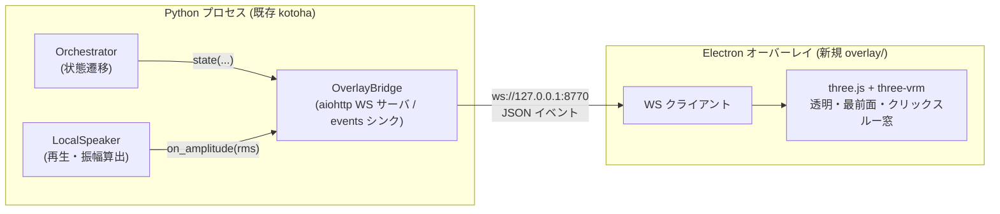

# デスクトップ・オーバーレイ(VRM キャラクター)設計

> 2026-06-26 初版。Kotoha のデスクトップ・オーバーレイ(desktopmate 的な VRM キャラクター常駐表示)の設計。
> 本 spec の対象は **SP1(オーバーレイ基盤)+ SP2(声ループ連動の契約)** まで。SP3/SP4 は後続 spec。
> 関連: [`2026-06-24-realtime-voice-bot-design.md`](2026-06-24-realtime-voice-bot-design.md)(声ループ本体)。

---

## 1. 目的とスコープ

### 1.1 目的

Kotoha の声ループに、**デスクトップ上に常駐する 3D VRM キャラクター**を重ねて表示し、会話の状態(待機/思考/発話)をキャラの挙動・口パクで可視化する。最終ゴールは desktopmate 相当のフルクローン(歩行・ウィンドウ干渉・物理・お触り反応)。

### 1.2 大きさと分解(サブプロジェクト)

フルクローンは性質の異なる複数サブシステムを含むため、独立した spec に分解して順に構築する。

| # | サブプロジェクト | 内容 | 依存 | 本 spec |
| --- | --- | --- | --- | --- |
| **SP1** | オーバーレイ基盤 | 透明・最前面・クリックスルー窓で VRM を待機表示。描画スタック確定。 | (土台) | ✅ 対象 |
| **SP2** | 声ループ連動 | Orchestrator が状態/口パクイベントを発信 → 窓が 待機/思考/発話＋口パク を反映。 | SP1 | ✅ 対象 |
| **SP3** | デスクトップ干渉 | ドラッグ、画面端/タスクバーに座る・歩く、簡易物理。 | SP1 | ⏳ 後続 |
| **SP4** | ウィンドウ相互作用・反応 | 他窓に登る/掴む、クリック/お触り反応、コンテキストメニュー。 | SP3 | ⏳ 後続 |

### 1.3 確定した前提(意思決定済み)

- **スコープ**: フル desktopmate クローン(段階構築。本 spec は SP1+SP2)。
- **キャラ形式**: 3D **VRM**。当面は**仮(サンプル)VRM** で基盤を作り、後で本モデルへ差し替え。
- **描画/連携スタック**: **Electron + three.js + `@pixiv/three-vrm`**、Python 声ループとは**ローカル WebSocket** で連携(ハイブリッド)。
- **プラットフォーム**: Windows。

---

## 2. 全体アーキテクチャ

2 プロセス構成。描画(Electron)と声ループ(Python)を分離し、ローカル WebSocket で繋ぐ。

- **Python = サーバ / オーバーレイ = クライアント**。声ループが長命の核なのでサーバ側に置く。
- **トランスポート**は既存依存の **aiohttp** の WebSocket サーバを使う(新規 Python 依存を増やさない)。
- **localhost 限定**(既定 `127.0.0.1:8770`、`Config` で変更可)。外部公開しない。
- オーバーレイは Python と**独立に起動**する(Python からの自動起動は SP3 以降で検討)。

---

## 3. SP1 — オーバーレイ基盤(Electron + three-vrm)

### 3.1 プロジェクト配置

- `overlay/` — 独立した Node/Electron プロジェクト(独自 `package.json`)。Python パッケージ `kotoha/` の外に置く。
- 主要ファイル:
  - `overlay/package.json` — Electron / three / @pixiv/three-vrm 等。
  - `overlay/main.js` — Electron main(ウィンドウ生成・挙動)。
  - `overlay/renderer/` — three.js シーン・VRM ローダ・アニメーションループ。
  - `overlay/config.json` — VRM パス・窓サイズ/位置・WS URL・目標 fps。
  - `overlay/assets/` — 仮 VRM(後で差し替え)。

### 3.2 ウィンドウ挙動(main)

`BrowserWindow` を次の設定で生成する:

- `transparent: true`、`frame: false`、`alwaysOnTop: true`、`skipTaskbar: true`、`hasShadow: false`、`resizable: false`。
- `setIgnoreMouseEvents(true, { forward: true })` で**クリックスルー**(SP1 既定。マウス操作はデスクトップへ素通り)。
- 初期位置は画面右下。サイズは config(既定 例 400×600)。

### 3.3 描画(renderer)

- three.js を透明背景(`alpha: true`、clearColor アルファ 0)で初期化。
- サンプル `.vrm` を `GLTFLoader` + `VRMLoaderPlugin` で読込。
- アイドル挙動: 自動まばたき + 微小な上体スウェイ + スプリングボーン更新(`vrm.update(delta)`)。
- カメラは上半身/全身を config で選択。目標 fps は config(既定 30)。

### 3.4 単体起動可能性

SP1 は **Python 無しで単独起動・検証可能**にする。WS 未接続でもアイドル表示を行い、開発用に**モックイベント注入**(キー操作やローカルの簡易送信スクリプト)で state/mouth を手動駆動できる。これにより描画基盤を声ループと切り離して確認できる。

---

## 4. SP2 — 声ループ連動の契約

### 4.1 状態モデル

Kotoha のライフサイクルを 4 状態で表す:

| 状態 | 意味 | 発信タイミング(Python 側) |
| --- | --- | --- |
| `idle` | 待機(何も処理していない) | 起動時 / ターン完了時(`_run_turn` の finally) |
| `listening` | ユーザー発話を検知中 | 発話オンセット検知時 / barge-in(`request_bargein`)時 |
| `thinking` | STT 後〜最初の音声が出るまで(LLM 生成中) | `handle_utterance` で STT 成功後、ターン開始時 |
| `speaking` | 音声再生中(口パク付き) | `_audio_to_playback` が最初の WAV を再生開始した時 |

> `listening` の発話オンセット検知: SP2 では `VadSegmenter` に**任意のオンセット/オフセット コールバック**(`on_speech_start` 等)を後方互換で追加し、`in_speech` の False→True で発火させる(既存テスト・既存挙動は不変を維持)。barge-in 経路では `request_bargein` から直接 `listening` を発信する。本状態は 4 状態中もっとも優先度が低く、最後に配線してよい。

### 4.2 Python 側の発信(疎結合)

- **events シンク**: 状態通知の最小インターフェース。
  - `state(value: str) -> None`
  - `mouth(level: float) -> None`(0.0–1.0)
- `Orchestrator.__init__` に `events` 引数を追加(**既定は no-op の `NullEvents`**)。既存の遷移点で `self._events.state(...)` を呼ぶだけ。**no-op 既定では一切の挙動変化なし**(既存テストに影響しない)。
- **口パく(振幅駆動)**: `LocalSpeaker` に任意の `on_amplitude: Callable[[float], None] | None` を追加。再生コールバック内で各チャンクの RMS(0–1 正規化)を算出して呼ぶ。コールバックは音声スレッドで動くため、ブリッジ側で `loop.call_soon_threadsafe` を介してループへマーシャリングする。オーバーレイは振幅を VRM の口ブレンドシェイプ(`Aa` / `mouthOpen`)へマッピング。

### 4.3 ブリッジ(`kotoha/overlay_bridge.py`)

- `OverlayBridge` が **events シンク I/F** を実装しつつ、**aiohttp の WebSocket サーバ**として接続クライアントへ JSON を配信する。
- スレッド安全: `state()`/`mouth()` は任意スレッドから呼ばれうるため、`loop.call_soon_threadsafe` で配信タスクへ渡す。
- 接続管理: 接続中 WS クライアント集合を保持し、各イベントを全クライアントへブロードキャスト。未接続なら黙って捨てる。
- `mouth` はスロットル(例 ~30–60Hz 上限)して送る。

### 4.4 配線

- `local_app`(`build_orchestrator`/`run_local`)が、設定で有効化されたとき `OverlayBridge` を起動し、Orchestrator の `events` と `LocalSpeaker` の `on_amplitude` に注入する(**既定オフ**。オーバーレイ無しでも声ループは従来どおり動く)。
- `Config` に `overlay_enabled: bool = False` / `overlay_ws_host: str = "127.0.0.1"` / `overlay_ws_port: int = 8770` を追加(frozen を維持して末尾追記)。

### 4.5 プロトコル(JSON over WebSocket, server→client)

- `{"type": "state", "value": "idle" | "listening" | "thinking" | "speaking"}`
- `{"type": "mouth", "value": 0.42}`(`speaking` 中のみ、0.0–1.0)
- client→server: 接続時に任意の `{"type": "hello"}`。SP1/SP2 では基本リードオンリー(将来 SP3/SP4 で双方向化)。

---

## 5. エラー処理 / 堅牢性

- **ブリッジはベストエフォート**: オーバーレイ未接続・送信失敗でもイベントは黙って破棄。**声ループはオーバーレイの有無・失敗で絶対にブロック・失敗しない**(fire-and-forget・例外は握ってログ)。
- **no-op 既定**: `events` 既定が `NullEvents` のため、オーバーレイ機能を使わない構成では声ループの挙動・性能は完全に従来どおり。
- **再接続**: Python 再起動時、オーバーレイは WS をバックオフ再接続。WS 切断中はアイドル表示にフォールバック。
- **VRM 読込失敗**: オーバーレイはコンソールに明示エラー(必要ならプレースホルダ表示)。

---

## 6. テスト方針

- **Python(単体・GUI/ネット不要、既存の fake 注入方針に準拠)**:
  - 各 Orchestrator 遷移で正しい `state(...)` が呼ばれる(fake シンクで呼び出し列を記録)。
  - `events` 既定(`NullEvents`)で既存挙動が不変であること。
  - `LocalSpeaker` の振幅 RMS 計算(既知サンプルで値域・単調性)。
  - `OverlayBridge` が fake WS クライアントへ正しい JSON を配信し、未接続時に例外を出さないこと。
  - `VadSegmenter` のオンセットコールバック発火(追加時、既存テスト緑を維持)。
- **実 WS 往復 / オーバーレイ描画**: `@pytest.mark.integration` または手動。サンプル VRM 表示・透明クリックスルー窓・モック WS による state/mouth 駆動を目視確認。自動 GUI テストは本 spec では作らない。

---

## 7. モジュール契約一覧(本 spec で新設/変更)

| モジュール | 種別 | 公開 I/F(要点) |
| --- | --- | --- |
| `kotoha/overlay_bridge.py` | 新規 | `class OverlayBridge(*, host, port, loop=None)`: `state(value:str)` / `mouth(level:float)` / `async start()` / `async stop()`。`class NullEvents`: 同 I/F の no-op。 |
| `kotoha/orchestrator.py` | 変更(後方互換) | `Orchestrator.__init__(..., events=NullEvents())`。遷移点で `self._events.state(...)`。既定挙動不変。 |
| `kotoha/voice/speaker.py` | 変更(後方互換) | `LocalSpeaker(..., on_amplitude=None)`。再生コールバックで RMS を `on_amplitude(level)`。 |
| `kotoha/voice/vad.py` | 変更(任意・後方互換) | `VadSegmenter(..., on_speech_start=None, on_speech_end=None)`。`in_speech` 遷移で発火。既存挙動不変。 |
| `kotoha/config.py` | 変更(末尾追記) | `overlay_enabled=False` / `overlay_ws_host="127.0.0.1"` / `overlay_ws_port=8770`。 |
| `kotoha/local_app.py` | 変更 | 設定有効時に `OverlayBridge` を起動し `events`/`on_amplitude` に注入。 |
| `overlay/`(Electron) | 新規 | 透明・最前面・クリックスルー窓 + three-vrm 描画 + WS クライアント。 |

---

## 8. 後続 spec(本 spec 対象外)

- **SP3 デスクトップ干渉**: ドラッグ(クリックスルーの動的切替)、画面端/タスクバーに座る・歩く、簡易物理。画面ジオメトリ・マルチモニタ対応。
- **SP4 ウィンドウ相互作用・反応**: 他ウィンドウの列挙・追従・掴む(OS API / ネイティブモジュール)、クリック/お触り反応、コンテキストメニュー、感情表現の拡張。

---

## 9. 未決事項

- 仮 VRM サンプルの選定(ライセンスがクリーンなもの。例: VRoid サンプル等)。本モデル提供後に差し替え。
- 口パくの品質: 当面は振幅駆動(RMS→口開度)。将来、母音推定や TTS 側のタイミング情報による高度化は別途検討。
- オーバーレイの Python からの自動起動(プロセス管理)の要否(SP3 で再検討)。

---

## 10. 受け入れ基準(本 spec の完了定義)

- **SP1**: サンプル VRM が、透明・最前面・クリックスルーの窓でアイドル表示され、デスクトップ操作を妨げない。Python 無しで単独起動・確認できる。
- **SP2**: 声ループ動作中、オーバーレイが `idle`/`thinking`/`speaking`(+ 口パク)を反映する。`listening` は最低限(barge-in 反応)を満たす。**オーバーレイ未使用時は声ループの挙動が完全に従来どおり**(既存ユニットテスト緑)。
