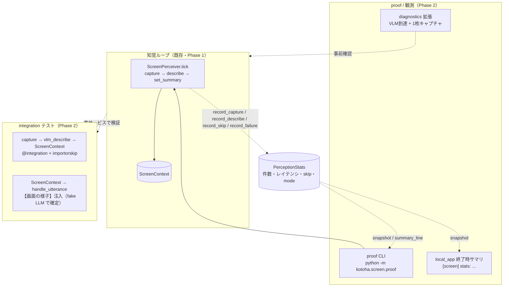

# 画面知覚 Phase 2 — 統合と proof の土台

2026-06-29。Phase 1 で画面知覚のループ（キャプチャ → VLM 要約 → `ScreenContext` → 会話への注入）は実装・実機確認まで到達した。Phase 2 はその上に、繰り返せる検証と目視確認、そして稼働中の観測性を載せる。新しい知覚能力は足さず、既にあるものを「測れて・通せて・見える」状態にすることに絞る。

Phase 1 spec は当初デスクトップ操作を Phase 2 に置いていた。だが操作グラウンディングへ進む前に、知覚そのものの土台を固めるほうが先である。操作グラウンディング（Holo2 等）は後続のフェーズへ送り、本 spec では扱わない。設計の正は [Phase 1 設計](2026-06-28-screen-perception-design.md)。

## 方針

Phase 1 の制約をそのまま引き継ぐ。知覚は best-effort で、キャプチャ・VLM のどの失敗でも会話ループを止めない。既定 OFF のオプトイン。スクリーンショットはディスクへ保存せず、要約テキストだけを保持する。本体はバックエンド非依存で、推論先は `build_config()` が読む環境変数で切り替える。

Phase 2 で足す3要素は、いずれも会話ループへ影響しない側に置く。観測は計測専用オブジェクトに閉じ込め、proof は独立した入口、integration テストは既定実行から除外する。

## 背景 — Phase 1 の到達点と既知の限界

到達点。`kotoha/screen/`（`state` / `detector` / `capture` / `perceiver` / `sanitize`）と `kotoha/llm/vlm_client.py` が揃い、`local_app` が背景タスクとして起動する。単一 GPU（RTX 4080）では会話と同じ `qwen3.5:4b`（vision 対応）を知覚にも使い回す。キャプチャは専用ワーカースレッドへ退避済みで、同一フレームは再要約せず鮮度だけ更新する。

限界。実機確認は手元の使い捨てスクリプトで一度通しただけで、リポジトリに残る自動・手動の検証口が無い。稼働中に「いま何枚撮り、VLM が何秒で、何回 skip したか」を機械的に知る手段が無く、レイテンシや skip 率の回帰を捕まえられない。Phase 1 plan の実機確認節は声データ待ちの TTS と同様に未消化のまま残っている。

## スコープと非スコープ

スコープ。計測オブジェクト `PerceptionStats`、`ScreenPerceiver` への計測フック、proof CLI、integration テスト、終了時サマリと診断拡張。

非スコープ。デスクトップ操作・座標出力（後続フェーズ）。マルチ GPU の VII/Vulkan 分離の新規実装（Phase 1 の `vlm_perception_url` / `aux_llm_url` で足り、本 spec では設計しない）。要約品質アルゴリズムの刷新（Phase 1 の `normalize_summary` を維持し、観測で初めて必要が見えたら別 spec で扱う）。

## 構成

知覚ループを中核に、計測・proof・テスト・診断を周辺へ疎結合に置く。各単位は単独で理解・テストでき、`PerceptionStats` の読み書きインターフェイスだけで結ばれる。

### PerceptionStats（`kotoha/screen/stats.py`）

知覚ループの計数とレイテンシをスレッドセーフに保持する純粋オブジェクト。perceiver（書き手・ワーカーとループの両スレッド）と CLI・local_app・診断（読み手）を疎結合にする。会話にも知覚判断にも影響しない、観測専用の容れ物とする。

インターフェイス。

- `record_capture(ms: float)` 1回のキャプチャ所要時間を加える。
- `record_describe(ms: float)` 1回の VLM 要約所要時間を加える。
- `record_skip()` 同一フレームで再要約を省いた回数を加える。
- `record_failure(kind: str)` 失敗を種別（`"capture"` / `"vlm"`）ごとに数える。
- `set_mode(mode: str)` 現在モードを記録する。
- `snapshot() -> dict` 現在値の不変コピーを返す。captures, describes, skips, failures（種別ごと）, last_capture_ms, avg_capture_ms, last_vlm_ms, avg_vlm_ms, summary_updates, mode。
- `summary_line() -> str` 1行の人間可読サマリ。例 `captures=42 describes=9 skips=33 vlm_avg=6.1s fail=0 mode=normal`。

平均は累積和と件数から求め、外部依存を持たない。`threading.Lock` でアクセスを直列化する。

### ScreenPerceiver への計測フック

`ScreenPerceiver.__init__` に `stats=None` を足す。`tick` で次を測る。キャプチャは executor 実行の前後、describe は await の前後の経過を `loop.time()` で計り、それぞれ `record_capture` / `record_describe` へ渡す。同一フレームで describe を省いた経路で `record_skip`、capture が例外・None、describe が例外のときに `record_failure` を呼ぶ。`run` の各サイクルで `set_mode(self._screen_ctx.mode)` を反映する。

`stats` が `None` のときは何も記録せず、既存挙動と完全に一致させる。best-effort の不変条件は崩さない。計測は失敗してもループへ伝播させない。

### proof CLI（`kotoha/screen/proof.py`、`python -m kotoha.screen.proof`）

Phase 1 で手元に作った確認スクリプトを、リポジトリの正式な入口として固める。`build_config()` で環境変数を反映し、実 `MssCapturer` か `DxcamCapturer`（`screen_capture_backend`）と `vlm_describe` を結線して、指定サイクル数または時間だけ知覚ループを回す。各サイクルで要約と `PerceptionStats.summary_line()` を表示し、最後に `snapshot()` を出す。`get_foreground_info()` と `resolve_mode` の結果も1度示す。GPT-SoVITS とマイクには触れない。

引数。`--cycles N`（既定 1）、`--duration S`（秒。指定時は時間優先）、`--backend mss|dxcam`、`--model`（既定は config）。`--cycles 1` を fake 注入で単体検証できるよう、ループ実体は引数から組んだ依存を受け取る薄い関数に分ける。

### integration テスト（`tests/screen/test_integration.py`）

`@pytest.mark.integration` を付け、既定の `-m "not integration"` から外す。各テスト冒頭で必要な実体（PIL・mss・到達可能な Ollama VLM）を `pytest.importorskip` と軽い疎通で確認し、無ければ skip する。

2本を置く。1本目は実サービス通し。`MssCapturer.capture()` → `vlm_describe()`（実 Ollama・vision モデル）→ `ScreenContext.set_summary()` を実行し、要約が空でなく取り出せることを確かめる。2本目は注入経路の確定検証。実要約を入れた `ScreenContext` を `Orchestrator` に渡し、fake の LLM ストリームで `handle_utterance` を回して、ユーザー発話の直前に `【画面の様子】` が入ることを assert する。2本目は実 LLM を要さず、注入の配線だけを実機非依存で固定する。

### 観測の配線と診断拡張

`local_app` は知覚有効時に `PerceptionStats` を作って perceiver へ渡し、終了処理で `print("[screen] stats: " + stats.summary_line())` を1行出す。画面タスクの gather 後、セッション終了前に呼ぶ。

`kotoha/diagnostics.py` に画面知覚レディネスのチェックを足す。`screen_perception_enabled` のとき、解決済みの VLM base_url（`vlm_perception_url or ollama_url`）へ `probe_llm_endpoint`（Phase 2 の health に既出）で到達確認し、`MssCapturer().capture()` が1枚返るかを試し、結果を `[diag] screen: ...` で示す。会話前に画面知覚の前提が揃っているかを `python -m kotoha.diagnostics` で確かめられるようにする。

## データフロー

perceiver の各 tick が `PerceptionStats` を更新し、その snapshot を CLI・local_app・診断が読む。知覚ループと観測は一方向で、観測側からループへ作用する経路は持たない。proof CLI だけはループを自分で起動する点が通常起動と異なるが、使う部品は同じである。

## エラー処理

計測・proof・診断・integration のいずれも会話ループの best-effort を損なわない。`PerceptionStats` の記録は例外を投げない実装にし、フックも握り潰す。proof CLI と診断は到達不可・キャプチャ失敗を異常終了ではなく結果表示として扱う。integration テストはサービス不在を失敗ではなく skip とする。

## テスト方針

`PerceptionStats` は純粋オブジェクトとして件数・平均・サマリ文字列をユニットテストする。perceiver の計測フックは、fake の stats を注入して capture・describe・skip・failure の各経路で対応する記録が呼ばれることを確かめる。proof CLI は、`--cycles 1` のループ実体に fake のキャプチャと describe を注入して、要約表示と stats 出力の流れを実機なしで検証する。診断拡張は fake セッションと fake キャプチャで分岐を固定する。実サービス必須の通しは integration テストに置き、既定実行から外す。

## 受け入れ基準

`python -m kotoha.screen.proof --cycles 3` が、画面要約と stats を表示して正常終了する。`python -m kotoha.diagnostics` が画面知覚の VLM 到達とキャプチャ可否を示す。`pytest -m integration` が、実 Ollama VLM のある環境で capture → 要約 → 注入を通す。`pytest -m "not integration"` は新規のユニットを含めて緑のまま。稼働後に `[screen] stats:` で1ターンあたりの実測値を確認できる。

## 未決・後続

要約品質の刷新（変化検出の perceptual-hash 化、要約の構造化）は、本 Phase の観測で必要が定量的に見えてから別 spec で扱う。マルチ GPU の VII/Vulkan 分離は、VII 接続後に proof CLI と診断で疎通を取りつつ詰める。デスクトップ操作グラウンディングは、知覚の土台が固まった後の独立フェーズとする。
